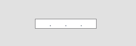

# IPMaskedTextBox
An IP masked textbox for WPF .NET

Extract a bytearray from the control with GetByteArray(), enabling you to easily initialize an IPAddress object with the user input.
 (trying to extract while there are empty fields will throw an exception)